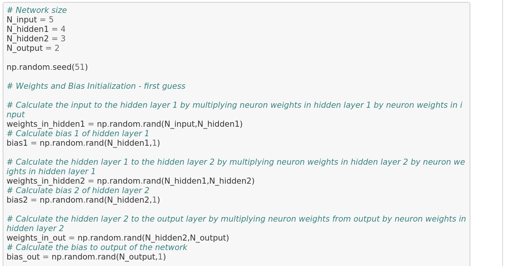
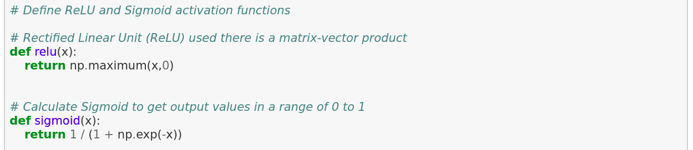
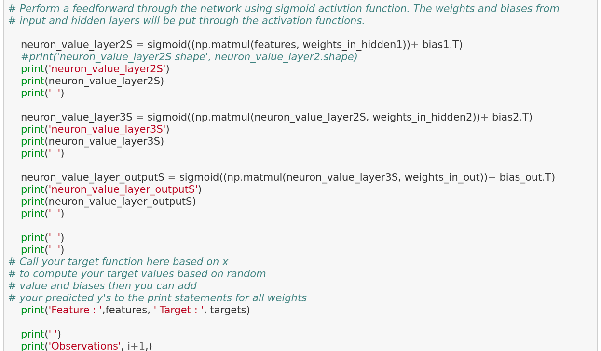
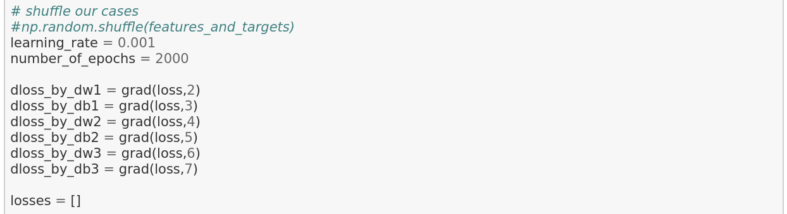
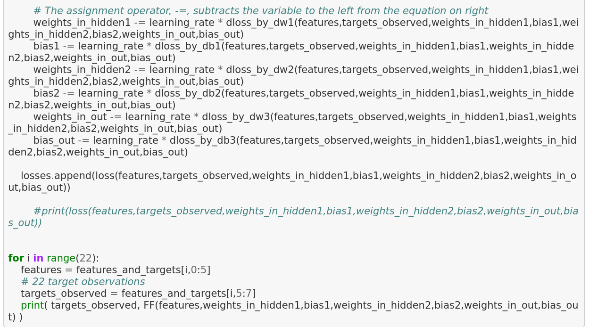
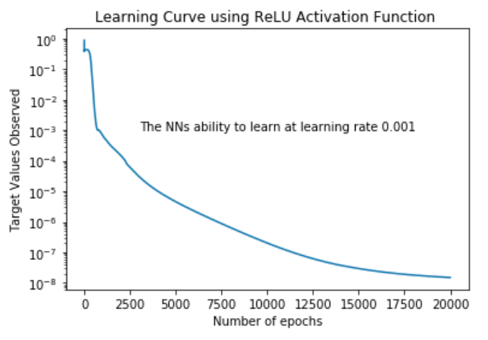

To have a basic understanding of the underlying mechanisms of an Artifical Neural Network model, imagine a neural network as a brain. Within oushownr brain there are probably billions of neurons bouncing back and forth sending information to different parts of our body. These active neurons are known as synapses and is how we learn things. In a neural network, activation functions are super important. They work similar to synapses by helping the model perform better by learning the complex patterns within the data. Feed-foward and back propogation algorithms were the processes to train the model. Side note: The artifical neural network model was originally developed in 1943 by Warren McCulloch and Walter Pitts. 

## Project Overview:

The architecture of the neural network is a four-layered structure that used data with 5 input features, 2 
hidden layers, and 2 output features. Weights and Bias were randomly selected. Feed-forward and back propogation algorithms 
were utilized. Sigmoid and ReLu (Rectified Linear Unit) activation functions were tested and gradient descent employed to 
optimize the sum of square residual (SSR) value. This artifical neural network has been trained and tested data without the help of built-in Python packages.

Image: Multi-layer Artificial Neural Network Structure

## Code in review:
This multi-layer neural network accepts five input values, which we will call features of the training 
data. The features were multiplied by corresponding "weights" and the products are added to the bias.(input features x weights) + "bias" is computed and is passed into the each layer, which contains specific activation functions. These activation functions produces the final output. The output of the current layer will be the input to the next layer and then it repeats. This is the feed-forward process. Code shown below:

# Activation Functions

# Feed-Forward 

# Back Propagation
Back propagation tries to find the error from the output found in the feed-forward by using the weights, loss function, and 
gradient decents. With the right learning rate and additional epochs (cycles), hopefully the algorithms is able to find the a 
better minimun as it moves throughout the gradient decent. The loss function allows for measuring how well the network is 
performing.

## Results:  
Overall, the Sigmoid function is not as good as the ReLU activation function in this case because ReLU provided 
more accurate predictions. With learning rates and increasing epochs being identical, ReLU continued to improve at a quicker 
rate over Sigmond. 

Image: Learning Improved when SSR Value Decreased

 
 ## Lessons Learned:
Adjustments to the learning rate, epochs, weights, and activation functions will allow you to see how the network reacts.
